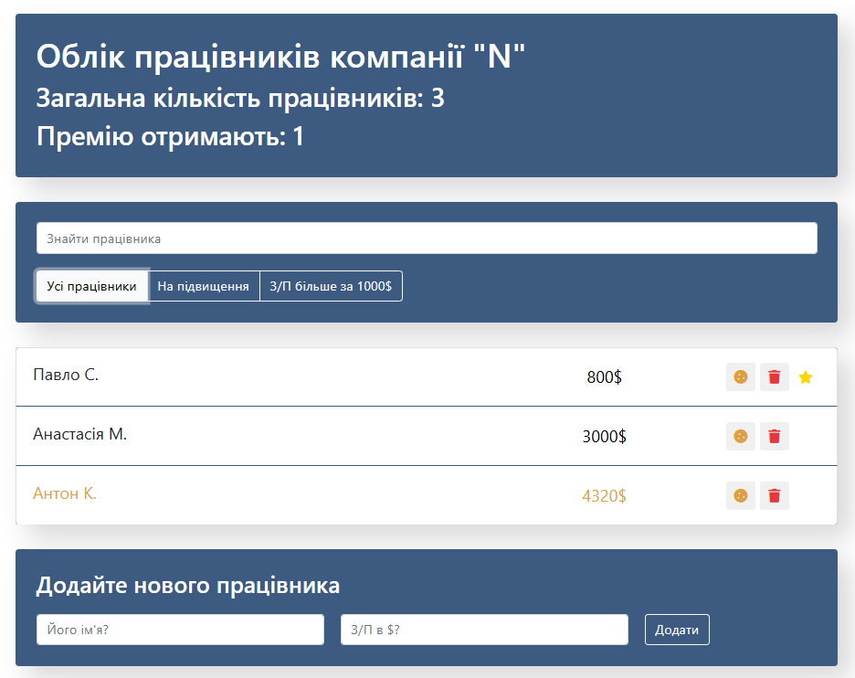

# React Employee Dashboard

A simple employee management dashboard built with React class components.  
This project was created as part of a frontend course to practice React fundamentals using the class-based approach.

🔗 **Live demo**: [https://mal3v14.github.io/react-employee-dashboard/](https://mal3v14.github.io/react-employee-dashboard/)

---

## 📸 Preview

 

---

## ⚙️ Tech Stack

- **React (Class Components)**
- **JavaScript (ES6+)**
- **CSS3**
- **Create React App**
- **Deployed via GitHub Pages**

---

## 📌 About the project

This dashboard allows users to manage a list of employees with features to:

- Add new employees
- Delete employees
- Toggle promotion and salary increase status
- Filter employees by search and conditions

The project was developed using React class components, focusing on:

- State management via `this.state`
- Handling events and methods inside classes
- Passing props between components
- Lifecycle methods (where applicable)

> ⚠️ **Note:** This project uses class components; however, there are plans to refactor it into functional components with React Hooks as part of future learning and improvement.

---
